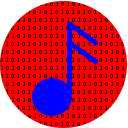

Project Overview

jAudio is a Digital Signal Processing project built to provide an easy-to-use program for audio feature extraction. Audio feature extraction is extracting properties, such as beat points, statistical summaries, along with many other less obviously useful properties. These properties can then be fed to machine learning toolkits (such as Weka) to automatically extract properties (such as artist or genre) from unknown music. More interesting applications include predicting how much a particular person will enjoy a given piece of music or other hit song predictors.

The application can be used through a GUI, a command-line interface, and with embedding support.  Help is best from the extensive in-application help system (requiring MultiHelp).  The [git archive](https://github.com/dmcennis/jAudioGIT/tree/master/extras/help/en_US) contains this documentation tree as well.

How to cite

If used in distributed use: McEnnis, Daniel, Cory McKay, Ichiro Fujinaga. 2006. "Overview of On-demand metadata extraction network (OMEN)". ISMIR.

If using limited individual Features - See citations on each feature. Features without citations belong to the paper that lists them

If using per-window many features:
McEnnis, Daniel, Ichiro Fujinaga, Cory McKay, Philippe DePalle. 2005. "JAudio: A feature extraction library". ISMIR.
McEnnis, Daniel, Ichiro Fujinaga. 2006. "jAudio: Improvements and additions". ISMIR.
If using per-file analysis: McEnnis, Daniel, Ichiro Fujinaga. 2006. "jAudio: Additions and improvements". ISMIR.
Constant-Q Transform: Santos, C., S. Netto, L. Biscainho, and D. Graziosi. 2004. A modified constant-Q transform for audio signals. IEEE ICASSP. 2: 469–72. (modified from the original in the most current versions - bins are weighted by percent of the spectrum it contains and the calculations were modified to extend over the entire window for each band)
Area Polynomial Approximation McEnnis, Daniel. 2010. Polynomial approximation in Research Log Book 2nd Edition. dmcennis@gmail.com Google Document. August 18.
History

jAudio is the end product of a collaboration between Cory McKay and Daniel McEnnis. The core design is from Daniel McEnnis. The core DSP engine is written by Cory McKay. Version 0.3 (published for the ISMIR 2005 conference) integrated the Daniel McEnnis's class project into Cory McKay's original implementation. This version was extended for 0.4 for the ISMIR 2006 conference. Additional extensions related to OMEN were added in 2006.
